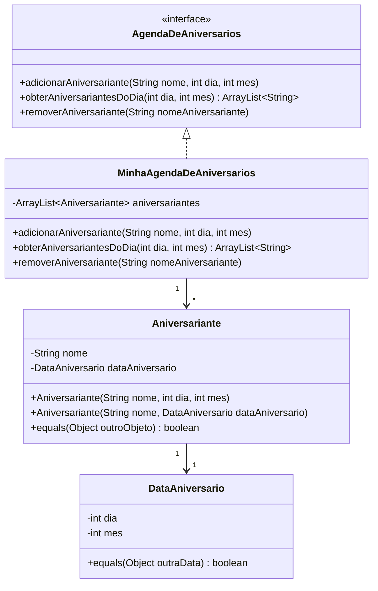

# Exercicio 1

## Diagrama

```mermaid
classDiagram
    AgendaDeAniversarios <|.. MinhaAgendaDeAniversarios
    MinhaAgendaDeAniversarios "1" --> "*" Aniversariante
    Aniversariante "1" --> "1" DataAniversario

    class AgendaDeAniversarios {
        <<interface>>
        +adicionarAniversariante(String nome, int dia, int mes)
        +obterAniversariantesDoDia(int dia, int mes) ArrayList~String~
        +removerAniversariante(String nomeAniversariante)
    }

    class MinhaAgendaDeAniversarios {
        -ArrayList~Aniversariante~ aniversariantes
        +adicionarAniversariante(String nome, int dia, int mes)
        +obterAniversariantesDoDia(int dia, int mes) ArrayList~String~
        +removerAniversariante(String nomeAniversariante)
    }

    class Aniversariante {
        -String nome
        -DataAniversario dataAniversario
        +Aniversariante(String nome, int dia, int mes)
        +Aniversariante(String nome, DataAniversario dataAniversario)
        +equals(Object outroObjeto) boolean
    }

    class DataAniversario {
        -int dia
        -int mes
        +equals(Object outraData) boolean
    }
```
